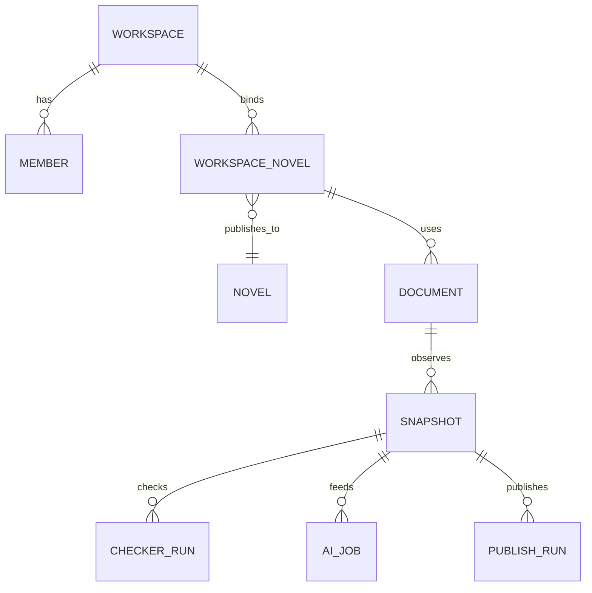

# Workspace logical data model

This catalogue is design input, not a migration.

| Tables | Core ownership and invariants |
| --- | --- |
| `workspace_workspaces`, `workspace_members` | opaque PKs; unique(workspaceId,userId); roles/status; versioned aggregates |
| `workspace_google_connections` | unique(userId,providerSubject); encrypted refresh token/keyVersion/scopes/status; server-only and audited |
| `workspace_novels`, `workspace_migration_registry` | unique(workspaceId,novelId); per-capability owner + cutover epoch/version |
| `workspace_documents`, `workspace_document_bindings` | unique(connectionId,providerFileId); role/sequence binding; title/URL not identity |
| `workspace_document_snapshots` | immutable provider revision, observedAt, normalizedSha256, normalizationVersion, object ref; unique document/revision and document/hash/version |
| `workspace_document_fingerprints` | current projection: revision, normalized hash, checker ruleset version, last-published hash |
| `workspace_kanban_boards/columns/cards/transitions` | unique stable keys/positions/source identity; card version; append-only transitions |
| `workspace_checker_rule_sets/runs/findings` | immutable versioned rules; run dedupe(snapshot,ruleset,engine); deterministic finding keys |
| `workspace_ai_jobs/job_attempts/ai_artifacts` | unique workspace idempotency key; attempt number/lease/error; immutable hashed artifacts |
| `workspace_publishing_destinations/publish_runs/publish_items` | destination uniqueness; expected last-published hash; per-item receipt; successful item immutable |
| `workspace_outbox`, `workspace_audit_events` | unique event/idempotency key; claim index; append-only security/state audit |

Normalization specifies Unicode form, line endings, structural separators, whitespace, ignored Docs metadata, and algorithm version. Revision identity and content hash stay separate. SHA-256 input carries a domain/version prefix.

Checker dedupe = snapshot + ruleset + engine version. AI dedupe includes snapshot + operation/prompt/model/policy version. Publish dedupe includes destination + logical episode + normalized hash + policy version.

All mutable aggregates use conditional `WHERE version=expected`; claims use lease and attempt records. Provider receipts precede success. Soft-delete audited entities; credentials are revoked and physically/cryptographically purged per policy. Content retention is shorter than hash/audit retention.
