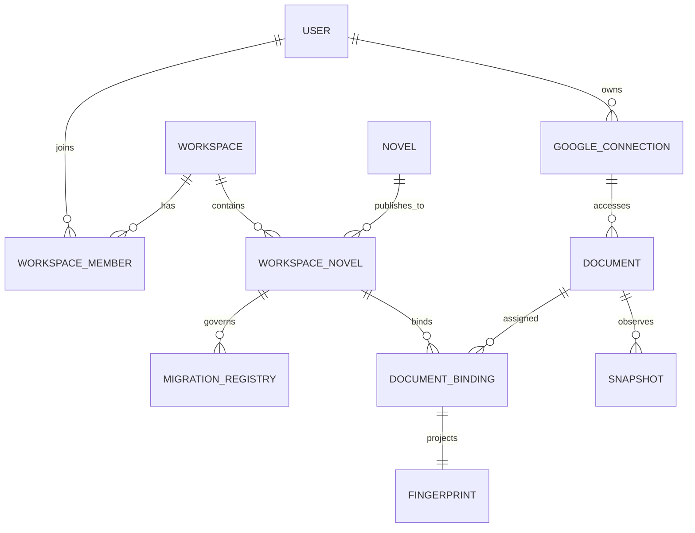
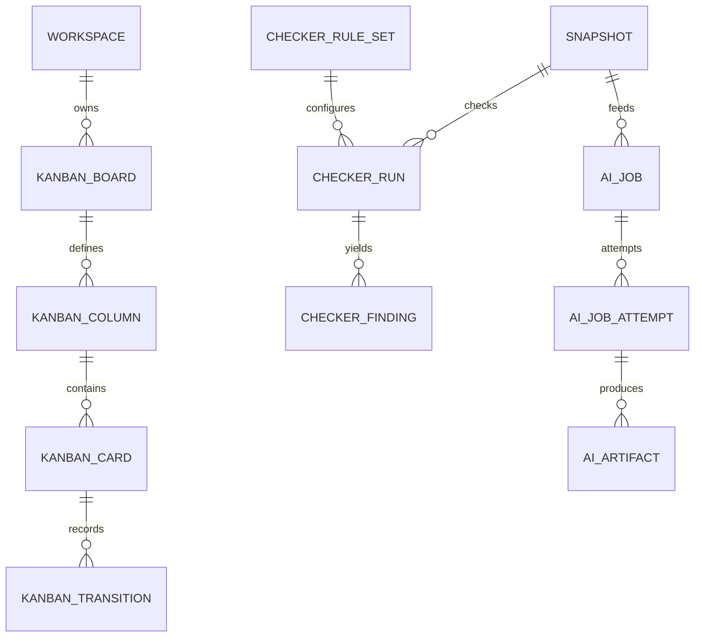
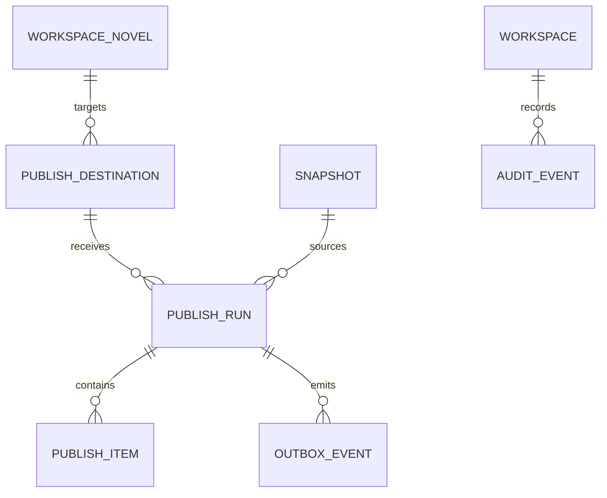

# Workspace logical data model

This catalogue is an implementable logical design input, not a migration. All IDs are opaque (UUID/ULID or equivalent); timestamps are UTC; mutable aggregate roots carry an integer `version`.

## Principal relationships

## Workspace and authorization catalogue

| Table | Owner/purpose | PK and essential columns | Foreign keys | Unique constraints and indexes | State enum | Retention |
| --- | --- | --- | --- | --- | --- | --- |
| `workspace_workspaces` | Workspace; collaboration root | `id`; `name, ownerUserId, status, version, createdAt, updatedAt, deletedAt` | `ownerUserId → users.id` | index `(ownerUserId,status)` | `active, suspended, archived` | tombstone 90 days after archive; audit references retained |
| `workspace_members` | Workspace; membership/RBAC | `id`; `workspaceId,userId,role,status,version,createdAt,updatedAt` | workspace, user | unique `(workspaceId,userId)`; index `(userId,status)` | role `owner,editor,reviewer,viewer`; status `active,invited,suspended,removed` | rows retained indefinitely as membership history |
| `workspace_google_connections` | User; incremental Docs/Drive authorization | `id`; `userId,providerSubject,encryptedRefreshToken,keyVersion,grantedScopes,tokenExpiresAt,status,version,lastUsedAt,revokedAt` | user | unique `(userId,providerSubject)`; index `(status,tokenExpiresAt)` | `active,reconnect_required,revoked,deleting` | purge ciphertext ≤24h after revoke/delete; metadata/audit 1 year |

## Novel migration and document catalogue

| Table | Owner/purpose | PK and essential columns | Foreign keys | Unique constraints and indexes | State enum | Retention |
| --- | --- | --- | --- | --- | --- | --- |
| `workspace_novels` | Workspace; binding to publication novel | `id`; `workspaceId,novelId,status,version,createdAt,updatedAt` | workspace, `novelId → novels.id` | unique `(workspaceId,novelId)`; index `(novelId,status)` | `active,paused,unlinked` | binding/audit retained after unlink |
| `workspace_migration_registry` | Workspace novel; per-capability action ownership | `id`; `workspaceNovelId,capability,owner,cutoverEpoch,version,changedAt,changedBy` | workspace novel, user(change actor) | unique `(workspaceNovelId,capability)`; index `(owner,capability)` | capability `kanban,checker,ai_queue,export,publish`; owner `sheets,workspace,paused` | indefinite |
| `workspace_documents` | Google connection; stable provider document | `id`; `connectionId,providerFileId,mimeType,titleCache,status,version,lastObservedAt` | Google connection | unique `(connectionId,providerFileId)`; index `(connectionId,status)` | `active,inaccessible,deleted,unbound` | identity metadata 1 year after final unbind |
| `workspace_document_bindings` | Workspace novel; assigns document role/order | `id`; `workspaceNovelId,documentId,role,sequence,status,version` | workspace novel, document | unique `(workspaceNovelId,documentId,role)`; unique `(workspaceNovelId,role,sequence)`; index `(documentId,status)` | role `source,chapter,glossary,reference`; status `active,paused,removed` | indefinite binding history |
| `workspace_document_snapshots` | Document; immutable observation/content reference | `id`; `documentId,providerRevisionId,providerVersion,observedAt,normalizedSha256,normalizationVersion,contentObjectKey,byteLength` | document | unique `(documentId,providerRevisionId)`; unique `(documentId,normalizedSha256,normalizationVersion)`; index `(documentId,observedAt)` | immutable; no state | content object 90 days unless referenced; hashes/metadata indefinite |
| `workspace_document_fingerprints` | Binding; current comparison projection | `id`; `bindingId,snapshotId,providerRevisionId,normalizedSha256,normalizationVersion,checkerRuleSetId,lastPublishedSha256,version,updatedAt` | binding, snapshot, optional checker rule set | unique `(bindingId)`; index `(normalizedSha256)`; index `(lastPublishedSha256)` | projection; no state | rebuildable; keep current plus audit events |

Normalization specifies Unicode form, line endings, structural separators, whitespace rules, ignored Docs metadata, and algorithm version. SHA-256 input includes a domain/version prefix. Provider revision identity and normalized content hash remain separate.

## Kanban catalogue

| Table | Owner/purpose | PK and essential columns | Foreign keys | Unique constraints and indexes | State enum | Retention |
| --- | --- | --- | --- | --- | --- | --- |
| `workspace_kanban_boards` | Workspace; workflow board | `id`; `workspaceId,name,slug,status,version` | workspace | unique `(workspaceId,slug)`; index `(workspaceId,status)` | `active,archived` | archived 1 year; transitions retained |
| `workspace_kanban_columns` | Board; ordered state definition | `id`; `boardId,key,name,position,wipLimit,status,version` | board | unique `(boardId,key)`; unique `(boardId,position)` | `active,archived` | never reuse key; retain while events reference |
| `workspace_kanban_cards` | Board; document/episode work item projection | `id`; `boardId,columnId,bindingId,logicalItemKey,rank,status,version,updatedAt` | board, column, optional binding | unique `(boardId,logicalItemKey)`; index `(columnId,rank)` | `active,blocked,done,archived` | active + 1 year archived |
| `workspace_kanban_transitions` | Card; immutable movement audit | `id`; `cardId,fromColumnId,toColumnId,actorUserId,reason,idempotencyKey,createdAt` | card, columns, user | unique `(cardId,idempotencyKey)`; index `(cardId,createdAt)` | immutable | indefinite |

## Checker catalogue

| Table | Owner/purpose | PK and essential columns | Foreign keys | Unique constraints and indexes | State enum | Retention |
| --- | --- | --- | --- | --- | --- | --- |
| `workspace_checker_rule_sets` | Workspace; immutable checker configuration | `id`; `workspaceId,name,versionNo,contentSha256,engineVersion,rulesJson,createdAt` | workspace | unique `(workspaceId,name,versionNo)`; unique `(workspaceId,contentSha256)` | immutable `published,retired` | retain every referenced version |
| `workspace_checker_runs` | Snapshot; deterministic execution | `id`; `snapshotId,ruleSetId,engineVersion,status,idempotencyKey,leaseOwner,leaseExpiresAt,version,startedAt,finishedAt` | snapshot, rule set | unique `(snapshotId,ruleSetId,engineVersion)`; unique `(idempotencyKey)`; claim index `(status,leaseExpiresAt)` | `queued,running,passed,failed,cancelled` | summary indefinite; diagnostics 1 year |
| `workspace_checker_findings` | Checker run; deterministic finding | `id`; `runId,ruleKey,severity,locationKey,excerptSha256,message,disposition,createdAt` | checker run | unique `(runId,ruleKey,locationKey,excerptSha256)`; index `(runId,severity)` | severity `info,warning,error`; disposition `open,accepted,fixed,ignored` | 1 year; hashes/audit indefinite |

## AI Queue catalogue

| Table | Owner/purpose | PK and essential columns | Foreign keys | Unique constraints and indexes | State enum | Retention |
| --- | --- | --- | --- | --- | --- | --- |
| `workspace_ai_jobs` | Workspace; durable requested operation | `id`; `workspaceId,snapshotId,operation,promptVersion,modelPolicyVersion,priority,status,idempotencyKey,version,createdAt` | workspace, snapshot | unique `(workspaceId,idempotencyKey)`; claim index `(status,priority,createdAt)` | `queued,claimed,running,succeeded,failed,cancelled` | metadata/audit 1 year minimum |
| `workspace_ai_job_attempts` | AI job; lease and provider attempt | `id`; `jobId,attemptNo,leaseOwner,leaseExpiresAt,providerRequestId,status,errorClass,startedAt,finishedAt` | AI job | unique `(jobId,attemptNo)`; index `(status,leaseExpiresAt)`; index `(providerRequestId)` | `claimed,running,succeeded,failed,abandoned` | 1 year |
| `workspace_ai_artifacts` | Attempt; immutable generated output reference | `id`; `attemptId,artifactType,contentObjectKey,contentSha256,moderationStatus,createdAt` | attempt | unique `(attemptId,artifactType,contentSha256)`; index `(contentSha256)` | moderation `pending,accepted,rejected` | content 90 days unless promoted; hash/receipt 1 year |

## Publishing and audit catalogue

| Table | Owner/purpose | PK and essential columns | Foreign keys | Unique constraints and indexes | State enum | Retention |
| --- | --- | --- | --- | --- | --- | --- |
| `workspace_publishing_destinations` | Workspace novel; existing IpeNovel target | `id`; `workspaceNovelId,targetType,targetId,status,policyVersion,version` | workspace novel; targetId resolved through publication port | unique `(workspaceNovelId,targetType,targetId)`; index `(status)` | `active,paused,revoked` | indefinite |
| `workspace_publish_runs` | Destination; aggregate publication operation | `id`; `destinationId,snapshotId,checkerRunId,status,idempotencyKey,expectedLastPublishedSha256,version,startedAt,finishedAt` | destination, snapshot, optional checker run | unique `(destinationId,idempotencyKey)`; index `(status,startedAt)` | `draft,validating,ready,publishing,published,partially_failed,failed,cancelled` | indefinite audit |
| `workspace_publish_items` | Publish run; episode-level result | `id`; `runId,itemKey,episodeId,sourceSha256,status,providerReceipt,errorClass,version,finishedAt` | run, optional `episodeId → episodes.id` | unique `(runId,itemKey)`; unique `(runId,episodeId,sourceSha256)`; index `(status)` | `pending,publishing,published,failed,skipped` | indefinite |
| `workspace_outbox` | Publish run; transactional delivery envelope | `id`; `workspaceId,publishRunId,eventType,payloadObjectKey,idempotencyKey,status,attempts,leaseOwner,leaseExpiresAt,availableAt,deliveredAt` | workspace, publish run | unique `(eventType,idempotencyKey)`; claim index `(status,availableAt,leaseExpiresAt)` | `pending,claimed,delivered,failed,dead_letter` | purge payload 30 days after delivery; receipt 1 year |
| `workspace_audit_events` | Workspace; append-only security/state audit | `id`; `workspaceId,actorUserId,eventType,entityType,entityId,correlationId,metadataJson,createdAt` | workspace, optional user | index `(workspaceId,createdAt)`; index `(entityType,entityId,createdAt)`; index `(correlationId)` | immutable | minimum 1 year; security events per policy |

## Cross-table invariants

- Every mutable update uses `WHERE version = expected`; zero affected rows is a conflict.
- Worker/outbox claims are atomic and lease-bounded; retry creates a new attempt, never rewrites an old attempt.
- Side-effect receipts are stored before terminal success. Successful publish items are never resent.
- Checker dedupe is snapshot + rule set + engine version.
- AI dedupe includes snapshot + operation + prompt/model/policy version.
- Publish dedupe includes destination + logical episode + normalized source hash + policy version.
- A connection/document cannot cross Workspace ownership without membership and binding checks.
- Audited entities soft-delete; credential ciphertext is the explicit purge exception.
